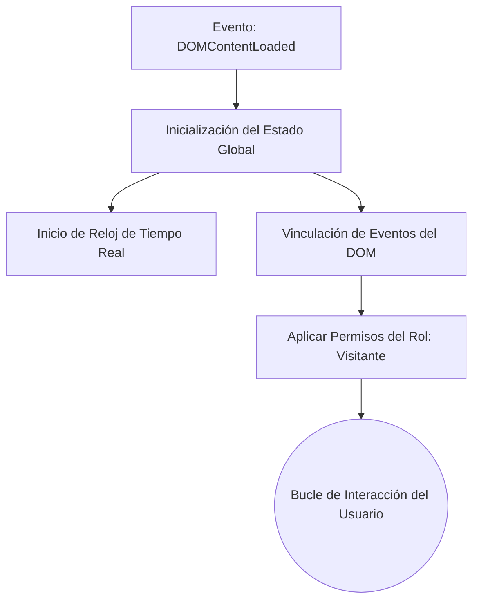

# 🧠 Arquitectura Lógica e Interactividad (`app.js`)
## **Sistema de Control de Asistencias - Instituto 124**
### *Documentación de Lógica Frontend y Control de Estado Reactivo Nativo*

Este documento detalla el diseño de software del motor interactivo desarrollado en JavaScript Vanilla para el frontend del **Sistema de Asistencias**. El archivo [app.js](file:///c:/Users/iamgu/Desktop/Practicas%203/Sistema%20de%20Asistencias/Sistema-Asistencia/app.js) actúa como el núcleo de comportamiento del cliente, emulando la interactividad de un framework moderno (como React o Vue) pero con cero dependencias externas.

---

## 🗺️ 1. Estructura General del Flujo Lógico

El archivo `app.js` gestiona la aplicación bajo un enfoque de **Máquina de Estados Finita** y arquitectura orientada a eventos. Su ciclo de vida se inicia al completarse la carga de la estructura de la página (`DOMContentLoaded`):



---

## 💾 2. Almacenamiento de Estado y Mock Database

Para brindar un comportamiento reactivo instantáneo sin requerir llamadas iniciales de servidor, el sistema implementa una **Single Source of Truth (Única Fuente de Verdad)** en memoria.

### 2.1. El Objeto `state`
Consolida todas las variables operacionales que definen qué está viendo el usuario y cuáles son las métricas temporales de la sesión:

```javascript
const state = {
  activeRole: "visitante",          // Permisos activos (visitante, preceptor, profesor, alumno)
  activeView: "login",              // Vista actual montada en pantalla
  pendingJustifications: 3,         // Solicitudes médicas pendientes en el dashboard
  scannedCount: 14,                 // Alumnos que han escaneado el QR dinámico activo
  qrTimeLeft: 15,                   // Cuenta regresiva para la rotación del token QR
  lastSelectedJustId: "1",          // Último certificado médico abierto en split-screen
  attendance: {                     // Registro táctil temporal del presentismo en el aula
    s1: null,                       // Alumno 1: "P" (Presente), "A" (Ausente), etc.
    s2: null,
    s3: null,
    s4: null
  }
};
```

### 2.2. Base de Datos en Memoria (`justificationsDb`)
Simula un almacén de base de datos relacional para la bandeja de entrada del preceptor. Cada registro contiene datos detallados del alumno, motivo y metadatos específicos del certificado:

```javascript
const justificationsDb = {
  "1": {
    name: "Lucas Gómez",
    role: "TS Software 1° Año",
    type: "Médico",
    badgeClass: "badge-warning",
    date: "04 de Mayo, 2026",
    subjects: "Análisis Matemático, Programación I",
    reason: '"Presento certificado médico..."',
    certTitle: "Sanatorio Central",
    certDr: "Dr. Carlos Rossi - Mat. 12894",
    certDesc: "Se prescribe reposo absoluto de 24 horas..."
  },
  // ... Registros adicionales (Sofía Martínez, Prof. Jorge Martínez)
};
```

---

## 🔄 3. Enrutamiento Virtual y SPA (Single Page Application)

Para simular una navegación fluida e instantánea sin recargas de página, el sistema oculta o muestra dinámicamente secciones HTML completas llamadas "vistas".

### 3.1. Metadatos de Navegación (`viewMeta`)
Se utiliza un objeto diccionario para actualizar dinámicamente los textos del encabezado (`<h1>` y `<p>`) según la sección a la que navegue el usuario:

| ID de Vista | Título del Módulo | Subtítulo / Descripción Dinámica |
| :--- | :--- | :--- |
| `login` | Login / Acceso | Ingresa tus credenciales o selecciona un perfil rápido... |
| `admin-dash` | Dashboard General Preceptoría | Métricas generales, control de inasistencias... |
| `admin-justifications`| Bandeja de Justificaciones | Revisión y aprobación en split-screen de comprobantes... |
| `teacher-attendance` | Toma de Asistencia Interactiva | Llamador de lista rápido táctil... |
| `student-dash` | Dashboard del Alumno | Transparencia de asistencia individual... |

### 3.2. Función de Enrutamiento `switchView(viewName)`
1.  **Ocultación**: Itera por todas las vistas con clase `.canvas-view` y les remueve la clase `.active` (la cual controla la visibilidad mediante transiciones CSS).
2.  **Activación**: Busca el contenedor de destino (`#view-[viewName]`) y le inyecta la clase `.active`.
3.  **Encabezado**: Lee los metadatos de `viewMeta[viewName]` y actualiza el título y subtítulo comunes en el layout.
4.  **Botones**: Recorre la botonera lateral de navegación e ilumina como activo únicamente el botón correspondiente a la vista actual.
5.  **Scroll reset**: Restablece el foco y scroll vertical del contenedor de visualización al inicio (`scrollTop = 0`).

---

## 🔐 4. Control de Accesos por Rol (RBAC Virtual)

El sistema oculta proactivamente las secciones del menú lateral según el rol activo para evitar accesos indebidos e implementar seguridad del lado del cliente.

```javascript
function applyRolePermissions(role) {
  state.activeRole = role;
  
  // Oculta todos los elementos con restricciones específicas de rol
  preceptorSections.forEach(s => s.style.display = "none");
  teacherSections.forEach(s => s.style.display = "none");
  studentSections.forEach(s => s.style.display = "none");

  // Reconfigura los accesos y la visualización según el perfil
  if (role === "preceptor") {
    preceptorSections.forEach(s => s.style.display = "block");
    activeRoleBadge.textContent = "👑 Preceptor (Admin)";
    switchView("admin-dash");
  } 
  // ... Lógica análoga para 'profesor' (Docente) y 'alumno'
}
```

> [!NOTE]
> Se provee soporte para **Accesos Rápidos (Shortcuts)** de depuración. Al hacer clic en los perfiles rápidos del Login, el sistema ejecuta de forma automática `applyRolePermissions()` cargando los dashboards simulados.

---

## 📊 5. Módulos Interactivos Clave

### 👨‍🏫 5.1. Toma de Asistencia Táctil (Llamador de Lista)
Implementado en el listado `#student-list-roll-call`.
*   **Gestor de Estados por Alumno**: Al hacer clic en los botones de estado (`P`, `A`, `T`, `J`) de cada fila de alumno, el sistema almacena de forma instantánea el valor dentro del objeto `state.attendance[studentId]`.
*   **Recálculo en Vivo (`updateRollCallStats()`)**: Recorre las filas, cuenta los estados activos y actualiza los marcadores del encabezado táctil en tiempo real:
    $$\text{Presentes (P)} \quad | \quad \text{Ausentes (A)} \quad | \quad \text{Tarde (T)} \quad | \quad \text{Justificados (J)}$$
*   **Acciones Colectivas**: El botón "Marcar todos como presentes" barre el DOM de la lista de estudiantes aplicando el estado `P` y refrescando los contadores en un solo ciclo.

### 🔄 5.2. Proyector de Código QR Rotativo (Antifraude)
Garantiza que los alumnos solo registren su asistencia si están físicamente dentro del aula mirando la proyección del docente.
*   **Ciclo de 15 segundos (`tickQrTimer`)**: Una cuenta regresiva disminuye por segundo. Al llegar a `0`, regenera el ciclo y simula un cambio de firma hash aplicando una traslación aleatoria en 2D (`transform: translate(x, y)`) a los puntos vectoriales del SVG del QR (`qrDynamicDots`).
*   **Simulación de Escaneo Real**: En paralelo, cada vez que el QR rota, el sistema simula de forma inteligente que un alumno real dentro del aula escanea exitosamente la proyección, añadiendo su avatar (`scanned-avatar`) al feed del proyector escolar e incrementando el presentismo de la cátedra.

### 🏥 5.3. Aprobación Split-Screen de Certificados Médicos
Bandeja de entrada automatizada para preceptoría.
*   **Renderizado Dinámico**: Al hacer clic en un certificado de la lista, la función `selectJustification(id)` recupera los datos de `justificationsDb` e inyecta un documento clínico estilizado dentro del visor derecho de forma dinámica (modificando la firma del médico, diagnóstico, institución y fechas).
*   **Flujo Transaccional**: El preceptor cuenta con botones para **Aprobar** o **Rechazar**:
    1.  Notifica mediante un sistema de alertas flotantes (*Toasts*).
    2.  Remueve físicamente el ítem de la lista del DOM aplicando transiciones suaves.
    3.  Elimina el registro de la base de datos temporal en memoria (`delete justificationsDb[id]`).
    4.  Resta un entero al contador global de tareas pendientes del preceptor.
    5.  Selecciona y renderiza automáticamente la siguiente solicitud pendiente.

### 🗺️ 5.4. Geofencing para Presentismo Docente (Clock-In / Clock-Out)
*   **Validación de Ubicación Escolar**: Simula el consumo de la API de Geolocalización del navegador.
*   **Restricción de Acciones**: Si el profesor se encuentra dentro del polígono geográfico del establecimiento, se habilita el botón de firma digital. Al firmar, se estampa la hora exacta y se bloquea el botón de entrada para evitar registros duplicados.

---

## 🔔 6. Servicios Auxiliares de Interfaz

### 6.1. Feed de Actividad en Vivo (Live Feed)
Inserta de manera asíncrona notificaciones simuladas de eventos escolares en vivo dentro de la consola del Preceptor cada 12 segundos (por ejemplo: *"Prof. Diego Álvarez firmó entrada"*, *"Alerta Temprana: Camila Sosa descendió a 74.8%"*). Posee una política de limpieza interna para mantener un máximo de 5 ítems en pantalla, optimizando la memoria del navegador.

### 6.2. Gestor de Notificaciones Toast (`createToast`)
Genera burbujas de notificación temporales de color en la esquina superior derecha:
```javascript
function createToast(message, type = "success") {
  // Crea el div, inyecta clases dinámicas, añade el icono según el tipo
  // Inserta en el contenedor flotante principal
  // Remueve de forma automática aplicando animación inversa tras 4 segundos
}
```

---

> [!TIP]
> **Integración en Producción**: En la etapa de migración real a base de datos, las funciones controladoras del estado interactivo como `selectJustification()`, `updateRollCallStats()` o `formUploadJust` deberán ser reemplazadas por peticiones de red utilizando `fetch()` (o librerías como Axios) hacia las rutas API de un backend persistente.
