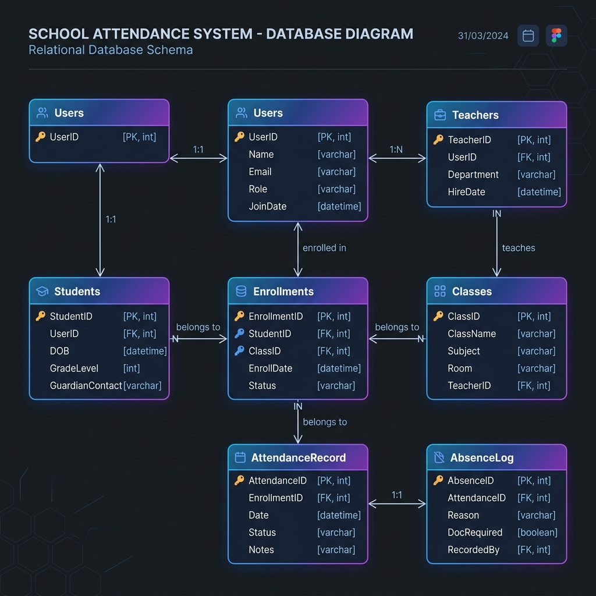
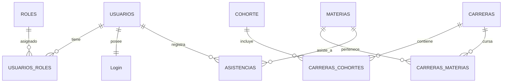
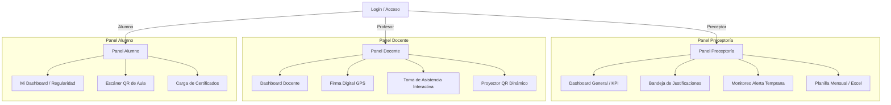

# 🏛️ Sistema de Control de Asistencias - Instituto 124
> **Plataforma Web Unificada y Modular para Preceptoría, Docentes y Alumnos**

Este repositorio contiene la implementación del **Sistema de Asistencias del Instituto 124**, una aplicación web interactiva de alto rendimiento y diseño premium (SPA) estructurada bajo el concepto de **Canvas Workspace**. Su objetivo principal es modernizar, agilizar y transparentar el control de asistencia institucional, eliminando el uso de planillas físicas y reduciendo la deserción escolar mediante herramientas inteligentes de alerta temprana y justificación digital.

---

## 🎯 Objetivo General del Sistema

El **Instituto 124** requiere un ecosistema integrado que reduzca la carga administrativa de los preceptores, valide en tiempo real la presencialidad docente para la liquidación de horas cátedra, y ofrezca a los alumnos una vía rápida y segura (vía QR dinámico) para registrar su asistencia, asegurando la transparencia de su estado académico de regularidad.

### Objetivos Específicos:
1. **Automatización del Registro**: Implementar métodos alternativos de registro como la toma de asistencia táctil por el docente o el auto-escaneo del alumno mediante códigos QR dinámicos autorotativos.
2. **Prevención del Abandono (Alerta Temprana)**: Monitorear de forma predictiva y en tiempo real a aquellos alumnos cuya asistencia promedio caiga por debajo del límite reglamentario del **75%**.
3. **Despapelización de Trámites**: Digitalizar la entrega de certificados médicos y de examen mediante una bandeja de entrada interactiva en doble pantalla (split-screen) que permite la aprobación inmediata de inasistencias con imputación automática.
4. **Firma Georreferenciada**: Asegurar la presencia física de los docentes en el establecimiento a través de una firma digital (Clock-In) vinculada a geolocalización GPS simulada (Geofencing).

---

## 💻 Arquitectura y Enfoque Tecnológico

El sistema ha sido desarrollado bajo los estándares de una **Single Page Application (SPA)** con un diseño visual disruptivo, utilizando tecnologías web puras para maximizar la velocidad de carga, la compatibilidad móvil-primero y la facilidad de mantenimiento.

### Stack de Tecnologías:
*   **HTML5 Semántico**: Estructura de documentos óptima para la accesibilidad (A11Y) y una jerarquía de encabezados limpia.
*   **CSS3 Vanilla (Luxe Carbon Theme)**: Estilo totalmente personalizado que prescinde de frameworks pesados como Tailwind. Utiliza:
    *   **Variables CSS (Custom Properties)** para un control centralizado de la paleta cromática (tonos índigo, esmeralda, ámbar, rosa y violeta).
    *   **Diseño Responsivo Avanzado**: Flexbox para alineaciones fluidas y CSS Grid para la distribución de tableros complejos de analíticas.
    *   **Glassmorphism**: Paneles translúcidos con desenfoque de fondo (`backdrop-filter`) que confieren un aspecto moderno y premium.
    *   **Micro-animaciones**: Transiciones de escala, pulsos de estado (`pulse-emerald`) y efectos de hover dinámicos en menús e íconos.
*   **JavaScript ES6+ (Native State Machine)**: Motor interactivo del lado del cliente que gestiona:
    *   **Máquina de Estados Global**: Un objeto `state` centralizado que rige el rol activo, la vista seleccionada, los contadores de notificaciones y la memoria temporal de asistencia del aula.
    *   **Enrutamiento Virtual**: Sistema de navegación asíncrono que alterna entre las 13 secciones sin recargar la página.
    *   **Simuladores de Sensores (Hardware)**: Geolocalización GPS por radio de tolerancia y lector óptico de cámara para escaneo QR.
    *   **Base de Datos Mockeada (InMemory)**: Almacén estructurado de justificaciones, perfiles y registros de entrada.
*   **Gráficos Vectoriales (SVG)**: Logos dinámicos, gráficos de barras de asistencias semanales y renderizado de la matriz de códigos QR dinámicos.

---

## 🗄️ Modelo y Diseño de Base de Datos (DER)

El diseño de la base de datos relacional está basado directamente en el relevamiento de la pizarra física (**PP III**) y ha sido adaptado con restricciones de integridad referencial, normalización estándar, claves primarias y foráneas, e índices de alto rendimiento para soportar las consultas del sistema de asistencias.

El script completo de creación de base de datos y carga de datos de prueba está guardado en el archivo [schema.sql](file:///C:/Users/iamgu/.gemini/antigravity/scratch/sistema-asistencia-canvas/schema.sql).

> 📊 **Recurso Interactivo de Presentación**: He diseñado un visualizador gráfico autoportante y dinámico en [diagrama.html](file:///C:/Users/iamgu/.gemini/antigravity/scratch/sistema-asistencia-canvas/diagrama.html) que puedes abrir en tu navegador para ver, acercar/alejar, centrar y exportar el diagrama de forma profesional. También puedes ver la versión de imagen estática en [diagrama_db.png](file:///C:/Users/iamgu/.gemini/antigravity/scratch/sistema-asistencia-canvas/diagrama_db.png).

### Diagrama de Entidad-Relación (DER)

Este es el diagrama relacional autogenerado con las llaves primarias (`PK`) y foráneas (`FK`) de cada tabla:



#### Representación de Flujo (Mermaid)



### Detalle de Tablas y Atributos de Pizarra:

#### 1. Entidades de Seguridad y Autenticación:
*   **`USUARIOS`**: Almacena el padrón de la institución (DNI, apellido, nombre y un ID secuencial autoincremental).
*   **`ROLES`**: Define los niveles de acceso. Ejemplo de datos de semilla: `Preceptor` (Id: 1), `Profesor` (Id: 2), `Alumno` (Id: 3).
*   **`USUARIOS_ROLES`**: Tabla intermedia que permite relaciones de muchos a muchos ($N:M$) para soportar que un preceptor también pueda actuar como docente.
*   **`Login`**: Almacena las credenciales de acceso de forma segura vinculadas uno a uno ($1:1$) con la tabla `USUARIOS` mediante la clave foránea `LoUSER`.

#### 2. Entidades Académicas:
*   **`CARRERAS`**: Listado de tecnicaturas superiores del establecimiento (ej. *Tecnicatura Superior en Desarrollo de Software*).
*   **`COHORTE`**: Agrupación por año lectivo de ingreso de cada división (ej. *Cohorte 2026*).
*   **`MATERIAS`**: Plan de estudios con especificación de modalidad (ej: *Presencial, Híbrido, Virtual*) y `MaCantModulos` que representa la carga horaria semanal expresada en bloques de clase.
*   **`CARRERAS_COHORTES`** y **`CARRERAS_MATERIAS`**: Tablas relacionales intermedias que mapean y estructuran la currícula educativa de la institución.

#### 3. Entidades de Control Presencial:
*   **`ASISTENCIAS`**: El núcleo de la transacción del sistema. Registra cada marca presencial de alumnos y docentes vinculando `UsId` (quién asiste) y `MaId` (materia o clase a la que asiste), resguardando la fecha (`AsFecha`), el estado lógico de presencia (`AsPresente` booleano) y si posee justificativo aprobado por preceptoría (`AsJustificacion` booleano).
*   **`MODULOS`**: Basado en el esquema de pizarra `DateTime M1 M2 M3 M4`, esta tabla estructura la distribución horaria estándar de las horas cátedra del Turno Noche (ej: *Módulo 1: 18:30 a 19:10 hs*, *Módulo 2: 19:10 a 19:50 hs*, etc.), permitiendo un control de presentismo parcial por bloque horario.

---

## 👑 Módulos del Sistema y Roles Operativos

La plataforma adapta su interfaz de forma dinámica según el rol del usuario que inicie sesión, inhabilitando o desplegando paneles enteros en la barra de navegación lateral.



### 1. Perfil Preceptoría (Administración)
*   **Dashboard General**: Cuatro tarjetas KPI que exponen porcentajes de presentismo diario docente (94.8%), presentismo de alumnos (82.1%), cantidad de justificaciones pendientes y total de alumnos en riesgo crítico.
*   **Visualización de Datos**: Un gráfico vectorial interactivo que detalla la asistencia promedio desagregada por carreras de nivel terciario (Software, Redes, Hotelería, Enfermería y Marketing).
*   **Bandeja de Justificaciones (Split-Screen)**: Panel de doble columna. A la izquierda se listan las solicitudes pendientes filtradas por tipo (Médico, Examen, Licencia); a la derecha se renderiza la previsualización del certificado digitalizado con detalles de las materias afectadas. Incluye botones reactivos para Aprobar (imputa el "Presente" de inmediato) o Rechazar.
*   **Monitoreo de Alerta Temprana**: Tabla interactiva que resalta en color carmesí a los alumnos con asistencia inferior al 75%. El preceptor puede buscar estudiantes en tiempo real y disparar notificaciones ("Enviar Alerta") individuales con un solo clic.
*   **Planilla Mensual Cruzada**: Matriz interactiva de asistencias mensuales por materia, simulando el formato de planilla ministerial listo para ser exportado a un reporte Excel.

### 2. Perfil Docente (Profesor)
*   **Firma Digital (Clock-In / Clock-Out)**: Un cronómetro en tiempo real vinculado a un detector GPS simulado. Si el docente está dentro del radio escolar, se habilita el botón de firma de entrada. Al firmar, se registra la hora exacta, calculando automáticamente las horas cátedra para su posterior liquidación.
*   **Toma de Asistencia Interactiva**: Una lista táctil de los alumnos asignados. Al pulsar las iniciales o el estado de cada estudiante (P: Presente, A: Ausente, T: Tarde, J: Justificado), se actualizan en tiempo real los contadores globales en la cabecera del módulo.
*   **Proyección de QR Dinámico**: Herramienta interactiva para proyectar en el proyector del aula. El código QR cambia su patrón de puntos y genera un token único cada 15 segundos para evitar que alumnos ausentes registren asistencia compartiendo capturas de pantalla desde fuera del aula. Muestra un avatar list de los alumnos que van escaneando de manera presencial en vivo.

### 3. Perfil Alumno (Estudiante)
*   **Mi Dashboard**: Indicador de porcentaje general de asistencias del estudiante mediante un medidor de regularidad de alta fidelidad. Alerta si el estudiante desciende a la zona de observación.
*   **Escáner de Aula**: Simulación del uso de la cámara del dispositivo móvil del alumno. Permite capturar el código QR proyectado por el profesor y emitir una alerta instantánea de éxito sincronizada con la base de datos de la preceptoría.
*   **Carga de Certificados**: Formulario reactivo con zona interactiva de "Drag and Drop" para cargar archivos PDF/imagen de justificativos médicos o certificados laborales.

---

## 🚀 Guía de Instalación y Uso Local

La aplicación está diseñada para ser completamente autoportante. No requiere bases de datos pesadas ni servidores complejos en su etapa de demostración de alta fidelidad.

### Requisitos Mínimos:
*   Cualquier navegador web moderno (Google Chrome, Mozilla Firefox, Microsoft Edge, Safari) compatible con especificaciones HTML5/CSS3.

### Pasos para Ejecutar:
1.  Clona el repositorio en tu máquina local:
    ```bash
    git clone https://github.com/IamGustav-Student/Sistema-Asistencia.git
    ```
2.  Navega hacia el directorio del proyecto:
    ```bash
    cd Sistema-Asistencia
    ```
3.  Abre el archivo `index.html` en tu navegador predeterminado (haciendo doble clic o utilizando extensiones como Live Server en VS Code).

### Cómo Testear la Simulación Multirrol:
1.  Al abrir la aplicación, te encontrarás en la pantalla de **Login**.
2.  Para explorar los diferentes paneles sin necesidad de ingresar contraseñas complejas, utiliza la sección **"💡 Accesos Rápidos de Simulación (Recomendado)"** en la parte inferior de la tarjeta de inicio de sesión.
3.  Haz clic en cualquiera de los botones:
    *   **Preceptor (Admin)**: Abre el flujo completo de administración.
    *   **Profesor**: Permite firmar asistencia por GPS, tomar lista o proyectar el QR dinámico.
    *   **Alumno**: Permite consultar regularidad, cargar un certificado o escanear el código QR.
4.  Cierra sesión en cualquier momento presionando el botón **🚪 Cerrar Sesión** al pie del menú lateral para cambiar de rol y comprobar la reactividad del sistema.

---

## 🛠️ Contribuciones y Desarrollo Futuro

Este prototipo sienta las bases interactivas del sistema. Las próximas fases de desarrollo contemplan:
1.  **Integración de Backend**: Conexión de la máquina de estados de JS con un backend basado en **Node.js / Express** o **Python FastAPI**.
2.  **Base de Datos Relacional**: Migración de la base de datos mock a **PostgreSQL** para resguardar la persistencia de legajos, inasistencias e historial de geolocalización.
3.  **Lector QR Real**: Implementación de la librería `html5-qrcode` para habilitar el uso real de la cámara trasera del smartphone en lugar de la vista simulada.
4.  **Servicio de Notificaciones**: Integración con APIs de mensajería (como Twilio o WhatsApp Business) para el envío automático de alertas a tutores ante la detección de riesgo crítico de regularidad.

---

*Desarrollado y optimizado con pasión para el Instituto 124.*
