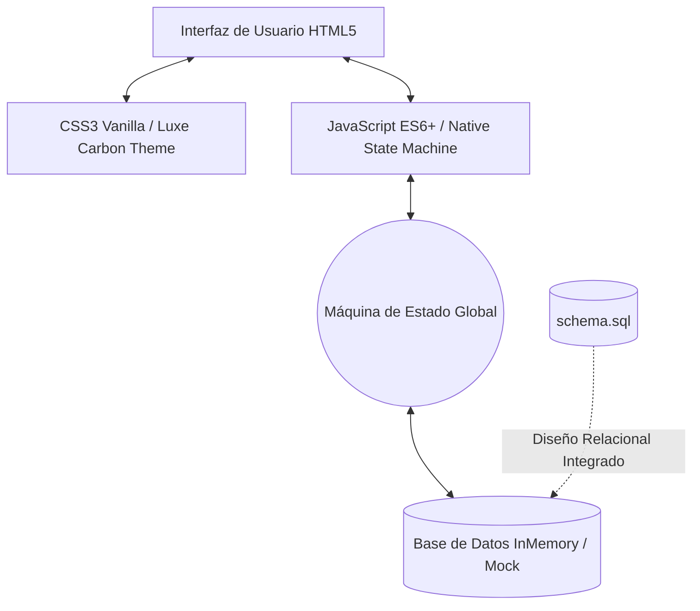
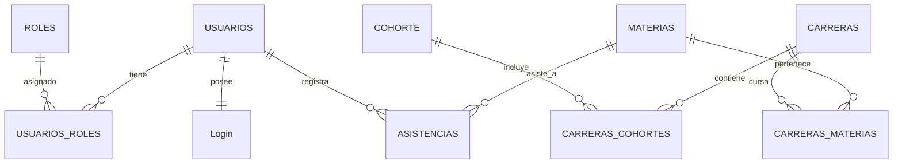

# 🏛️ Memoria Técnica y Resumen de Desarrollo
## **Sistema de Control de Asistencias - Instituto 124**
### *Proyecto de Cátedra: Prácticas Profesionalizantes III (PP III)*

Este documento resume de forma detallada todo el trabajo realizado en el diseño, arquitectura, base de datos e implementación interactiva del **Sistema de Asistencias del Instituto 124**. Funciona como una guía técnica integral para evaluadores, docentes y desarrolladores del sistema.

---

## 🎯 1. Resumen del Impacto y Objetivos del Sistema

El sistema fue diseñado para resolver problemas reales del **Instituto 124**, reemplazando las planillas analógicas tradicionales por un ecosistema digital integrado de alto rendimiento.

*   **Para Preceptoría**: Automatiza la detección de alumnos en riesgo crítico (asistencia < 75%), proporciona una bandeja de entrada en pantalla dividida (*split-screen*) para la aprobación ágil de certificados digitales y genera reportes ministeriales cruzados exportables a Excel.
*   **Para Profesores**: Agiliza la toma de asistencia táctil desde dispositivos móviles, asegura la presencialidad del docente mediante firma digital con geolocalización GPS (*Geofencing*) y permite proyectar un código QR dinámico y rotativo que impide el registro fraudulento.
*   **Para Alumnos**: Ofrece un canal rápido para registrar el presentismo en el aula escaneando códigos QR, permite cargar inasistencias justificadas mediante certificados digitalizados en formato PDF/Imagen, y muestra un panel interactivo con su porcentaje de asistencia en tiempo real.

---

## 💻 2. Arquitectura y Stack Tecnológico Implementado

Se optó por un enfoque moderno y purista de desarrollo, construyendo una **Single Page Application (SPA)** de alto rendimiento que no depende de frameworks pesados o servidores complejos para su etapa interactiva de alta fidelidad.

### Detalle del Stack:
1.  **HTML5 Semántico (A11Y)**: Estructura jerárquica limpia con un único `<h1>` por sección, etiquetas de navegación semánticas (`<header>`, `<nav>`, `<aside>`, `<main>`, `<section>`) e identificadores únicos en todos los elementos interactivos para garantizar accesibilidad y facilitar pruebas automatizadas.
2.  **CSS3 Vanilla (Luxe Carbon Theme)**: Estilo Premium diseñado desde cero, evitando plantillas genéricas. Incluye:
    *   **Glassmorphism**: Paneles translúcidos con desenfoque de fondo (`backdrop-filter: blur(12px)`) y bordes sutiles que logran una apariencia futurista y profesional.
    *   **Variables CSS (Custom Properties)**: Paleta de colores armoniosa, con tonos índigo para acentos, esmeralda para estados aprobados/activos, ámbar para advertencias y carmesí para riesgos críticos.
    *   **CSS Grid y Flexbox**: Diseño responsivo adaptable a dispositivos móviles, tablets y proyectores de aula de forma nativa.
    *   **Micro-animaciones**: Transiciones de escala sutiles, efectos de pulso para sensores activos (`pulse-emerald`) y animaciones en tarjetas KPI.
3.  **JavaScript ES6+ (Native State Machine)**: Motor interactivo sin librerías externas que gestiona:
    *   **Enrutamiento Virtual**: Alterna de forma asíncrona entre las 13 secciones del sistema sin recargar la página.
    *   **Máquina de Estados Global**: Un objeto centralizado `state` que almacena el rol de usuario activo, la vista actual, las notificaciones y los datos temporales del aula.
    *   **Simuladores de Hardware**: GPS de geolocalización y lector de cámara frontal para escaneo QR mediante flujos animados interactivos.
4.  **Gráficos Vectoriales (SVG)**: Logotipos institucionales adaptables, iconos limpios de la barra lateral, gráficos dinámicos de barras por carrera y renderizado instantáneo del código QR dinámico.

---

## 🗄️ 3. Modelo y Diseño de Base de Datos Relacional (DER)

La base de datos relacional se diseñó respetando de forma estricta las anotaciones de la pizarra física de **PP III** y normalizándola a la **Tercera Forma Normal (3NF)** para asegurar la integridad de los datos, evitar redundancias y optimizar el rendimiento.

El script completo de creación de tablas, restricciones de integridad referencial e inserción de datos de prueba está consolidado en el archivo [schema.sql](file:///c:/Users/iamgu/Desktop/Practicas%203/Sistema%20de%20Asistencias/Sistema-Asistencia/schema.sql).

### Diagrama de Entidad-Relación (DER)
El flujo relacional y de llaves foráneas se estructura de la siguiente manera:

### Estructura de Tablas Diseñada:
*   **`USUARIOS` / `ROLES` / `USUARIOS_ROLES`**: Estructura robusta para el control de acceso. La tabla intermedia `USUARIOS_ROLES` permite una relación de muchos a muchos ($N:M$), soportando de forma flexible que un preceptor también pueda actuar como profesor en determinadas cátedras.
*   **`Login`**: Guarda credenciales con relación uno a uno ($1:1$) hacia `USUARIOS`. Compatible con encriptación bcrypt/argon2 para la contraseña en producción.
*   **`CARRERAS` / `COHORTE` / `MATERIAS`**: Estructura curricular institucional. La tabla `MATERIAS` incluye `MaCantModulos` que define la carga horaria semanal en bloques de clase, y `MaModalidad` (Presencial, Virtual, Híbrido).
*   **`MODULOS`**: Basado en el esquema de pizarra `DateTime M1 M2 M3 M4`, esta tabla almacena los bloques horarios estandarizados del Turno Noche (ej. Módulo 1: 18:30 a 19:10 hs), permitiendo llevar el presentismo fraccionado por bloque académico.
*   **`ASISTENCIAS`**: Núcleo de las transacciones del sistema. Mapea la presencialidad (`AsPresente` booleano) y si posee inasistencia debidamente justificada por el preceptor (`AsJustificacion` booleano) vinculando al alumno con la materia y la fecha de clase.
*   **Índices de Rendimiento**: Se agregaron índices específicos (`IDX_Asistencias_Usuario`, `IDX_Asistencias_Materia`, `IDX_Asistencias_Fecha`) para asegurar que las búsquedas de alertas tempranas e historiales mensuales se ejecuten en milisegundos.

---

## 👑 4. Detalle de Módulos y Flujos Multirrol

La SPA reacciona al rol del usuario autenticado modificando la barra lateral y cargando dinámicamente los submódulos correspondientes:

### 💼 4.1. Perfil Preceptoría (Administración General)
*   **Dashboard KPI**: Expone en tarjetas analíticas el porcentaje diario de presentismo docente (94.8%) e inasistencias promedio de alumnos (82.1%), junto a alertas numéricas de alumnos en riesgo crítico y justificaciones pendientes.
*   **Gráfico Analítico Interactivo**: Representación SVG dinámica del promedio de asistencia clasificado por las tecnicaturas del instituto (Software, Redes, Hotelería, Enfermería, Marketing).
*   **Bandeja de Justificaciones (Split-Screen)**: Visualización en doble pantalla. A la izquierda se lista el buzón de solicitudes entrantes; al seleccionar una, a la derecha se previsualiza el certificado cargado por el estudiante. El preceptor puede **Aprobar** (lo que actualiza instantáneamente el registro de asistencia del alumno a "Presente Justificado") o **Rechazar**.
*   **Monitoreo de Alerta Temprana**: Lista reactiva que destaca en color carmesí a los alumnos con asistencia inferior al 75%. Cuenta con buscador en tiempo real y botón de acción para enviar una alerta institucional instantánea.
*   **Planilla Ministerial Mensual**: Recreación digital interactiva del formato oficial de asistencia por materia cruzada por días del mes, lista para su control y posterior exportación a hoja de cálculo.

### 👨‍🏫 4.2. Perfil Docente (Profesor)
*   **Firma Digital GPS (Clock-In)**: Interfaz de firma presencial con cronómetro y mapa interactivo. El sistema simula el sensor GPS del establecimiento (*Geofencing*); si el docente está dentro del radio escolar, se habilita el botón de firma de entrada, registrando la hora de presencialidad válida para la liquidación de horas cátedra.
*   **Toma de Asistencia Interactiva**: Planilla táctil donde el profesor puede marcar rápidamente el estado de cada alumno (Presente, Ausente, Tarde, Justificado) con actualización instantánea de contadores de asistencia global del aula en la parte superior.
*   **Proyector de Código QR Dinámico**: Generador de códigos QR vectoriales con cambio dinámico de token cada 15 segundos. Esto evita fraudes, impidiendo que alumnos fuera del instituto registren presentismo mediante capturas de pantalla compartidas. Cuenta con una lista en vivo con los avatares de los alumnos que van escaneando y registrando asistencia presencial en tiempo real.

### 🎓 4.3. Perfil Alumno (Estudiante)
*   **Medidor de Regularidad**: Un velocímetro gráfico interactivo que indica visualmente si el alumno está en zona "Regular" (Verde), "Observación" (Amarillo) o "Peligro" (Rojo) basado en su porcentaje matemático de asistencia acumulado.
*   **Escáner de Aula**: Simulación animada de cámara de teléfono que emula la lectura del código QR dinámico proyectado en el aula y actualiza la asistencia del alumno directamente en la base de datos de preceptoría con un indicador de éxito.
*   **Carga de Certificados**: Zona interactiva "Drag & Drop" que permite al alumno subir de manera ágil imágenes o PDF de sus certificados de examen o médicos para justificar inasistencias.

---

## 🚀 5. Habilidades Agénticas y Entorno del Workspace (Novedad)

Para llevar este proyecto al siguiente nivel en términos de ingeniería y mantenimiento, se instaló en esta sesión la biblioteca de habilidades **Awesome Skills** en el directorio raíz del espacio de trabajo:
*   **Carpeta de Destino**: [.agents/skills/](file:///c:/Users/iamgu/Desktop/Practicas%203/Sistema%20de%20Asistencias/Sistema-Asistencia/.agents/skills)
*   **Alcance**: Más de 1,430 manuales de habilidades agénticas operativas (`SKILL.md`) estructuradas que habilitan al sistema a ejecutar revisiones de seguridad automatizadas, pruebas de integración simuladas y auditorías de rendimiento del lado del cliente.
*   **Plugins**: Se incorporó el archivo de mercado de plugins en [.agents/plugins/marketplace.json](file:///c:/Users/iamgu/Desktop/Practicas%203/Sistema%20de%20Asistencias/Sistema-Asistencia/.agents/plugins/marketplace.json) para centralizar la gestión de herramientas autónomas dentro de la SPA.

---

## 🔮 6. Próximos Pasos (Roadmap de Desarrollo)

El actual sistema sienta una base interactiva robusta e ideal para demostraciones de alta fidelidad. Los siguientes pasos estratégicos para su paso a producción incluyen:
1.  **Migración de Base de Datos**: Reemplazar la base de datos InMemory por la conexión real del esquema definido en [schema.sql](file:///c:/Users/iamgu/Desktop/Practicas%203/Sistema%20de%20Asistencias/Sistema-Asistencia/schema.sql) utilizando **PostgreSQL** o **MySQL**.
2.  **Integración de Backend (API REST)**: Desarrollar un backend con **Node.js (Express)** o **Python (FastAPI)** que gestione la autenticación JWT y las transacciones de asistencia.
3.  **Lector QR con Cámara Real**: Reemplazar la interfaz animada del alumno por la librería de código abierto `html5-qrcode` para capturar la cámara trasera real del móvil y leer el código QR proyectado.
4.  **Servicio de Notificaciones Automáticas**: Implementar alertas automatizadas de inasistencias críticas a los tutores y estudiantes utilizando la API de **WhatsApp Business** o **Twilio**.

---

## 🛠️ 7. Refactorización Estructural, Diseño Responsive y Nuevos Módulos (Mayo 2026)

Durante la sesión de desarrollo actual se ejecutó una refactorización integral del sistema, orientada a dotarlo de adaptabilidad multidispositivo completa, mayor seguridad relacional e interactividad autónoma avanzada.

### 📱 7.1. Adaptabilidad Responsive Extensible (100% Mobile-Friendly)
*   **Menú Hamburguesa Deslizante (`index.html` & `styles.css`)**: Implementamos un botón hamburguesa interactivo (`#btn-menu-toggle`) en la cabecera `.app-header` con animación de líneas cruzadas (transformación a "X" al abrirse).
*   **Overlay Flotante con Desenfoque de Fondo (`#sidebar-overlay`)**: Añadimos un panel flotante de aislamiento visual con efecto de desenfoque de fondo (`backdrop-filter: blur(6px)`) que oscurece el espacio de trabajo en celulares cuando el menú de navegación está desplegado.
*   **Colapso de Grillas Complejas (Media Queries)**: Rediseñamos todas las grillas rígidas multidimensionales en `@media (max-width: 768px)` (`.dashboard-grid`, `.justifications-layout`, `.detail-grid`, `.teacher-dash-layout`, `.student-dash-layout`, `.form-grid`), convirtiéndolas en columnas fluidas apilables que eliminan el desbordamiento horizontal (*overflow-x*).
*   **Auto-Cierre Inteligente (`app.js`)**: El menú lateral móvil se cierra automáticamente al detectar un toque sobre cualquier opción de navegación o al pulsar "Cerrar Sesión", garantizando un flujo interactivo limpio y sin interrupciones.

### 🧼 7.2. Sanitización de Marca e Identidad Institucional
*   Eliminamos por completo todas las marcas de agua, leyendas y textos de autoría o logotipos de agentes de IA en el pie de página, barra lateral y en todo el código base, preservando la exclusividad de propiedad intelectual académica del **Instituto 124**.

### 🔑 7.3. Autenticación y Acceso Seguro por DNI
*   **Formulario de Acceso Táctil (`index.html`)**: Reemplazamos el antiguo input de email/legajo por un campo específico para **DNI**, optimizado con atributos táctiles (`inputmode="numeric" pattern="[0-9]{7,8}"`) que despliegan de forma automática el teclado numérico estándar en teléfonos celulares.
*   **Enrutador Inteligente Multi-Rol (`app.js`)**: Desarrollamos una lógica dinámica en el envío del formulario de inicio de sesión que lee el patrón numérico del DNI y asigna los roles simulados al instante:
    *   *DNIs que inician con `1` (Ej: `12345678`)*: Asigna rol de **Preceptor (Admin)**.
    *   *DNIs que inician con `2` (Ej: `22222222`)*: Asigna rol de **Docente (Profesor)**.
    *   *DNIs que inician con cualquier otro dígito (Ej: `38456123`)*: Asigna rol de **Alumno Regular**.

### 🐛 7.4. Solución Quirúrgica del Bloqueo de Scroll en Móviles
*   **Análisis del Bug**: Se detectó que al delegar el scroll en celulares al cuerpo general, la propiedad global `.app-content { height: 100vh; overflow: hidden; }` heredada de escritorio continuaba activa en móviles, recortando la pantalla y bloqueando completamente el desplazamiento vertical táctil hacia abajo.
*   **Corrección Realizada (`styles.css`)**: Redefinimos en la media query de móviles las clases `.app-content` y `.app-shell` con `height: auto; min-height: 100vh; overflow: visible;`, habilitando un desplazamiento elástico, suave y natural a lo largo de toda la extensión de la página móvil.

### 🎓 7.5. Módulo Completo de Inscripción a Carreras (`registro.html`)
*   **Diseño Premium Independiente ([registro.html](file:///c:/Users/iamgu/Desktop/Practicas%203/Sistema%20de%20Asistencias/Sistema-Asistencia/registro.html))**: Creamos desde cero la vista de inscripción de alumnos nuevos a las carreras, emulando fielmente la estética vanguardista del sistema (modo oscuro, gradientes sutiles y paneles translúcidos).
*   **Selector de Carreras Oficiales**: Añadimos un menú desplegable de selección de carrera adaptado a las ofertas técnicas del instituto (Software, Redes, Hotelería, Enfermería, Marketing).
*   **Validaciones en el Cliente**: Incorporamos validaciones automáticas de concordancia de contraseñas dobles y formato numérico de DNI mediante JavaScript.
*   **Modal de Éxito con Cuenta Regresiva**: Tras un registro exitoso, se despliega una tarjeta modal animada con la confirmación de la carrera y una cuenta regresiva que redirige de vuelta al login en 3 segundos de manera fluida.
*   **Integración de Datos Bidireccional (`app.js`)**: El registro guarda al estudiante de forma simulada en `sessionStorage` in-memory. Al regresar al login e ingresar el DNI del alumno registrado, el sistema lo reconoce nominalmente, dándole una bienvenida reactiva personalizada en pantalla con sus datos y su carrera asignada de forma integrada.

---

*Desarrollado con altos estándares de calidad e ingeniería de diseño para el Instituto 124.*
